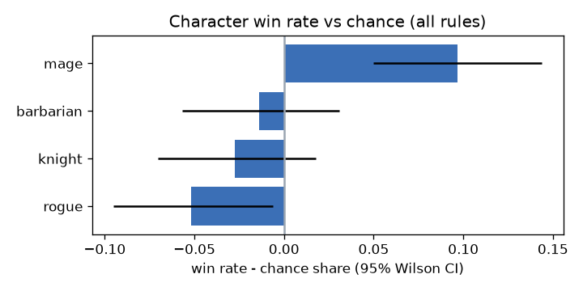
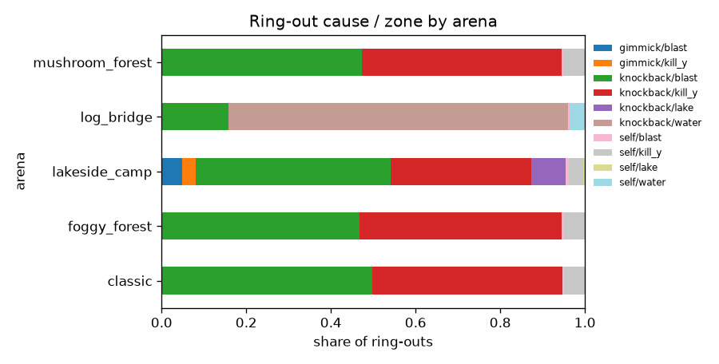

# M5 — Balance (character / arena / style)

> **Bot-only data.** Every slot is a scripted BotController (difficulty presets + jitter). Results describe how the *bots* use each character and arena, not how people will. Use them to validate the pipeline and spot gross imbalances only.

1802 slot rows from 596 finished matches. `expected` = chance share (1/players, 0.5 in team); `excess` = win_rate − expected.

## Win rate by character

| character | n | wins | win_rate | ci_low | ci_high | expected | excess |
|---|---|---|---|---|---|---|---|
| barbarian | 472 | 185 | 0.392 | 0.349 | 0.437 | 0.406 | -0.014 |
| knight | 464 | 179 | 0.386 | 0.343 | 0.431 | 0.413 | -0.027 |
| mage | 431 | 218 | 0.506 | 0.459 | 0.553 | 0.409 | 0.097 |
| rogue | 435 | 151 | 0.347 | 0.304 | 0.393 | 0.399 | -0.052 |

## Win rate by character (1v1 stock only)

| character | n | wins | win_rate | ci_low | ci_high | expected | excess |
|---|---|---|---|---|---|---|---|
| barbarian | 91 | 45 | 0.495 | 0.394 | 0.595 | 0.500 | -0.005 |
| knight | 102 | 51 | 0.500 | 0.405 | 0.595 | 0.500 | 0.000 |
| mage | 75 | 42 | 0.560 | 0.447 | 0.667 | 0.500 | 0.060 |
| rogue | 84 | 38 | 0.452 | 0.350 | 0.559 | 0.500 | -0.048 |

## Win rate by style

| style | n | wins | win_rate | ci_low | ci_high | expected | excess |
|---|---|---|---|---|---|---|---|
| boxer | 907 | 336 | 0.370 | 0.340 | 0.402 | 0.403 | -0.032 |
| ranged | 431 | 218 | 0.506 | 0.459 | 0.553 | 0.409 | 0.097 |
| weapon | 464 | 179 | 0.386 | 0.343 | 0.431 | 0.413 | -0.027 |

## Win rate by arena x character

| arena | character | n | win_rate | expected | excess |
|---|---|---|---|---|---|
| classic | barbarian | 94 | 0.404 | 0.410 | -0.005 |
| classic | knight | 78 | 0.385 | 0.431 | -0.046 |
| classic | mage | 74 | 0.486 | 0.440 | 0.046 |
| classic | rogue | 93 | 0.419 | 0.412 | 0.007 |
| foggy_forest | barbarian | 87 | 0.425 | 0.397 | 0.029 |
| foggy_forest | knight | 76 | 0.368 | 0.405 | -0.036 |
| foggy_forest | mage | 97 | 0.515 | 0.403 | 0.113 |
| foggy_forest | rogue | 93 | 0.290 | 0.405 | -0.115 |
| lakeside_camp | barbarian | 90 | 0.322 | 0.404 | -0.081 |
| lakeside_camp | knight | 98 | 0.388 | 0.418 | -0.030 |
| lakeside_camp | mage | 86 | 0.512 | 0.384 | 0.128 |
| lakeside_camp | rogue | 73 | 0.370 | 0.380 | -0.010 |
| log_bridge | barbarian | 98 | 0.429 | 0.411 | 0.018 |
| log_bridge | knight | 110 | 0.336 | 0.411 | -0.075 |
| log_bridge | mage | 79 | 0.456 | 0.420 | 0.036 |
| log_bridge | rogue | 79 | 0.443 | 0.397 | 0.046 |
| mushroom_forest | barbarian | 103 | 0.379 | 0.407 | -0.028 |
| mushroom_forest | knight | 102 | 0.451 | 0.404 | 0.047 |
| mushroom_forest | mage | 95 | 0.547 | 0.404 | 0.143 |
| mushroom_forest | rogue | 97 | 0.237 | 0.397 | -0.160 |

## Win rate by bot preset (bot_difficulty column)

| bot_difficulty | n | wins | win_rate | ci_low | ci_high | expected | excess |
|---|---|---|---|---|---|---|---|
| busy | 623 | 202 | 0.324 | 0.289 | 0.362 | 0.407 | -0.083 |
| normal | 606 | 253 | 0.417 | 0.379 | 0.457 | 0.401 | 0.017 |
| slow | 573 | 278 | 0.485 | 0.444 | 0.526 | 0.413 | 0.072 |

## Logistic regression (odds ratios, match-bootstrap 95 % CI)

Reference levels: character=barbarian, arena=classic, rule=stock, bot_difficulty=normal; controls: rule, player_count, arena, bot preset.

| term | odds_ratio | ci_low | ci_high |
|---|---|---|---|
| character_rogue | 0.872 | 0.677 | 1.152 |
| character_knight | 0.963 | 0.727 | 1.272 |
| character_mage | 1.641 | 1.241 | 2.166 |
| arena_lakeside_camp | 0.993 | 0.934 | 1.059 |
| arena_log_bridge | 1.003 | 0.948 | 1.066 |
| arena_mushroom_forest | 0.980 | 0.914 | 1.042 |
| arena_foggy_forest | 0.981 | 0.926 | 1.037 |
| rule_team | 3.171 | 3.014 | 3.416 |
| rule_timed | 0.989 | 0.936 | 1.034 |
| bot_difficulty_slow | 1.287 | 1.006 | 1.617 |
| bot_difficulty_busy | 0.643 | 0.511 | 0.786 |
| player_count | 0.572 | 0.551 | 0.590 |

## Ring-outs by arena (cause / zone share)

6675 ring-outs; self-destructs: 5.0%.

| arena | cause | zone | count | share |
|---|---|---|---|---|
| classic | knockback | blast | 636 | 0.497 |
| classic | knockback | kill_y | 576 | 0.450 |
| classic | self | kill_y | 62 | 0.048 |
| classic | self | blast | 6 | 0.005 |
| foggy_forest | knockback | kill_y | 644 | 0.476 |
| foggy_forest | knockback | blast | 633 | 0.468 |
| foggy_forest | self | kill_y | 68 | 0.050 |
| foggy_forest | self | blast | 7 | 0.005 |
| lakeside_camp | knockback | blast | 570 | 0.460 |
| lakeside_camp | knockback | kill_y | 411 | 0.332 |
| lakeside_camp | knockback | lake | 101 | 0.082 |
| lakeside_camp | gimmick | blast | 61 | 0.049 |
| lakeside_camp | self | kill_y | 43 | 0.035 |
| lakeside_camp | gimmick | kill_y | 40 | 0.032 |
| lakeside_camp | self | blast | 8 | 0.006 |
| lakeside_camp | self | lake | 5 | 0.004 |
| log_bridge | knockback | water | 1058 | 0.803 |
| log_bridge | knockback | blast | 207 | 0.157 |
| log_bridge | self | water | 48 | 0.036 |
| log_bridge | self | blast | 4 | 0.003 |
| mushroom_forest | knockback | blast | 702 | 0.472 |
| mushroom_forest | knockback | kill_y | 701 | 0.471 |
| mushroom_forest | self | kill_y | 77 | 0.052 |
| mushroom_forest | self | blast | 5 | 0.003 |
| mushroom_forest | gimmick | kill_y | 2 | 0.001 |
