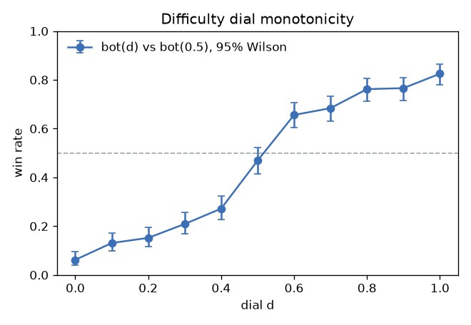

# DDA — difficulty dial, probe skill estimator, win probability with d

Generated by `python -m brawl_analysis export-models` (analysis/src/brawl_analysis/dda_report.py). Design: docs/superpowers/specs/2026-10-01-dda-probe-bots-design.md.

## 1. Dial monotonicity (bot(d) vs bot(0.5), 1v1 classic, every character pair)

Monotonic increasing: **True**. Source `dda_sweep.csv` (scripts/dda_sweep.sh).

| d | matches | wins | losses | draws | win_rate | ci_lo | ci_hi | avg_ticks |
|---|---|---|---|---|---|---|---|---|
| 0.000 | 320 | 20 | 300 | 0 | 0.062 | 0.041 | 0.095 | 2943.600 |
| 0.100 | 320 | 42 | 278 | 0 | 0.131 | 0.099 | 0.173 | 2951.100 |
| 0.200 | 320 | 48 | 271 | 1 | 0.152 | 0.116 | 0.195 | 2951.100 |
| 0.300 | 320 | 67 | 253 | 0 | 0.209 | 0.168 | 0.257 | 3037.400 |
| 0.400 | 320 | 87 | 233 | 0 | 0.272 | 0.226 | 0.323 | 3068.300 |
| 0.500 | 320 | 150 | 170 | 0 | 0.469 | 0.415 | 0.523 | 3203.900 |
| 0.600 | 320 | 210 | 110 | 0 | 0.656 | 0.603 | 0.706 | 3109.600 |
| 0.700 | 320 | 219 | 101 | 0 | 0.684 | 0.632 | 0.733 | 2907.300 |
| 0.800 | 320 | 244 | 76 | 0 | 0.762 | 0.713 | 0.806 | 2765.900 |
| 0.900 | 320 | 245 | 75 | 0 | 0.766 | 0.716 | 0.809 | 2583.500 |
| 1.000 | 320 | 264 | 56 | 0 | 0.825 | 0.780 | 0.863 | 2608.200 |

## 2. Skill estimator (probe features -> d)

800 probed matches; 5-fold CV. MAE **0.144** (mean baseline 0.245), R^2 **0.584**; 1v1 only: MAE 0.141, R^2 0.592.

| feature | slope_per_d | corr |
|---|---|---|
| react_ticks | 3.314 | 0.074 |
| response_rate | 0.159 | 0.287 |
| dodge_rate | 0.023 | 0.123 |
| tech_rate | 0.026 | 0.018 |
| punish_rate | 0.246 | 0.172 |
| damage_share | 0.299 | 0.497 |
| attack_rate | 0.520 | 0.648 |
| edge_share | -0.033 | -0.092 |

## 3. Win probability with d (logistic, GDScript-exact)

174473 timeline rows, 800 matches, GroupKFold by match.

| index | log_loss | auc | brier |
|---|---|---|---|
| with_d | 0.403 | 0.887 | 0.131 |
| without_d | 0.444 | 0.861 | 0.146 |
| with_d_first_30s | 0.506 | 0.819 | 0.168 |
| without_d_first_30s | 0.565 | 0.764 | 0.192 |

| feature | coef (std) |
|---|---|
| t | 0.113 |
| player_count | -0.113 |
| damage | -0.040 |
| stocks | 0.216 |
| edge_dist | 0.116 |
| side_stocks | 0.283 |
| side_damage | -0.119 |
| foe_best_stocks | -0.375 |
| foe_damage | 0.179 |
| stock_diff | 0.873 |
| damage_diff | 0.211 |
| score_diff | 1.875 |
| foe_sides_alive | -0.292 |
| d_diff | 0.879 |
| is_team | 0.251 |
| is_timed | -0.046 |

## 4. DDA convergence (fixed-d player bot vs DDA bots)

Source `dda_converge.csv` (scripts/dda_converge.gd). Target band 0.45-0.60.

| player_d | variant | matches | player_win_rate | ci_lo | ci_hi | bot_d_end_mean | adjustments_mean | probe_estimate_mean | rating_end |
|---|---|---|---|---|---|---|---|---|---|
| 0.100 | on | 100 | 0.460 | 0.366 | 0.557 | 0.133 | 4.630 | 0.336 | 0.290 |
| 0.100 | off | 100 | 0.140 | 0.085 | 0.221 | 0.500 | 0.000 | 0.336 | 0.369 |
| 0.300 | on | 100 | 0.590 | 0.492 | 0.681 | 0.257 | 5.720 | 0.226 | 0.356 |
| 0.300 | off | 100 | 0.230 | 0.158 | 0.322 | 0.500 | 0.000 | 0.226 | 0.357 |
| 0.500 | on | 100 | 0.570 | 0.472 | 0.663 | 0.414 | 6.490 | 0.366 | 0.356 |
| 0.500 | off | 100 | 0.580 | 0.482 | 0.672 | 0.500 | 0.000 | 0.366 | 0.524 |
| 0.700 | on | 100 | 0.620 | 0.522 | 0.709 | 0.638 | 6.400 | 0.576 | 0.852 |
| 0.700 | off | 100 | 0.690 | 0.594 | 0.772 | 0.500 | 0.000 | 0.576 | 0.504 |
| 0.900 | on | 100 | 0.700 | 0.604 | 0.781 | 0.753 | 5.300 | 0.690 | 0.923 |
| 0.900 | off | 100 | 0.780 | 0.689 | 0.850 | 0.500 | 0.000 | 0.690 | 0.570 |
