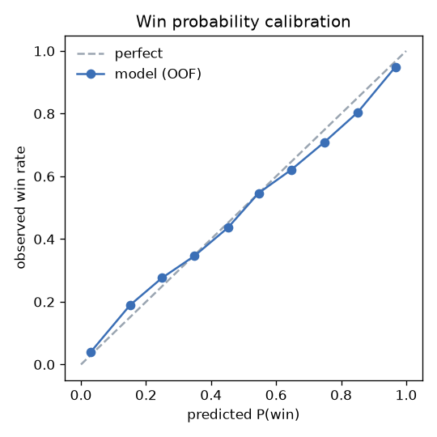
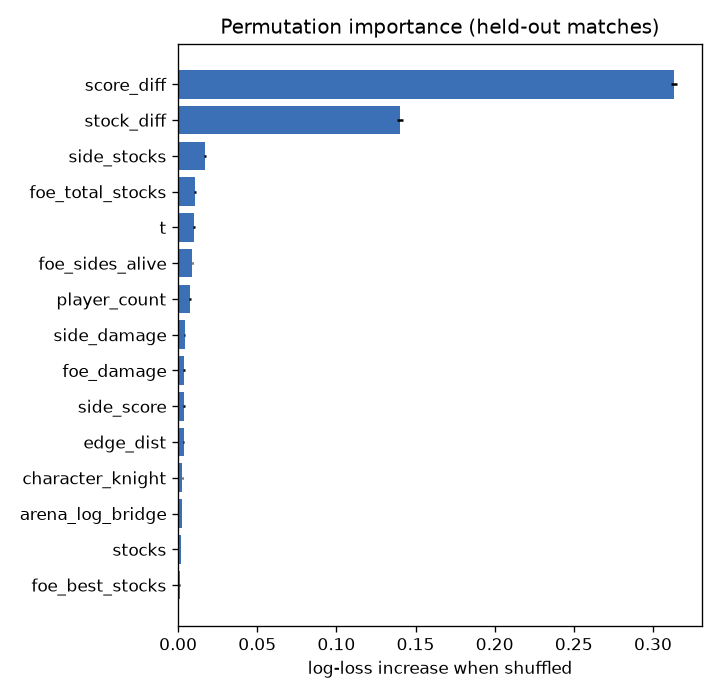
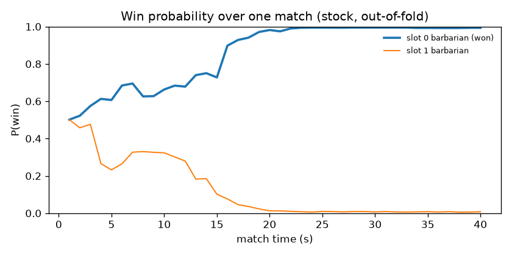

# M2 — Win probability (timeline → does this slot's side win)

> **Bot-only data.** Every slot is a scripted BotController (difficulty presets + jitter). Results describe how the *bots* use each character and arena, not how people will. Use them to validate the pipeline and spot gross imbalances only.

120159 timeline rows from 596 finished matches, 5-fold GroupKFold by match_id (out-of-fold predictions). Features are only values known at that tick (state, side/foe stocks, damage, score, edge distance, gauge, time, rule/arena/character); no duration or final counters.

## Metrics (lower log-loss / Brier is better)

| index | log_loss | auc | brier |
|---|---|---|---|
| prior (1/n) | 0.639 | 0.626 | 0.224 |
| logistic (stock/damage/score diff) | 0.461 | 0.849 | 0.152 |
| HistGradientBoosting | 0.443 | 0.860 | 0.147 |

## By match phase

| t_bucket_s | rows | log_loss | auc | brier |
|---|---|---|---|---|
| [0.0, 15.0) | 25216 | 0.619 | 0.697 | 0.215 |
| [15.0, 30.0) | 26358 | 0.511 | 0.814 | 0.171 |
| [30.0, 60.0) | 36526 | 0.411 | 0.885 | 0.133 |
| [60.0, 120.0) | 31117 | 0.286 | 0.944 | 0.089 |
| [120.0, 1000000000.0) | 942 | 0.277 | 0.940 | 0.094 |

## Calibration

| predicted | observed |
|---|---|
| 0.029 | 0.039 |
| 0.151 | 0.190 |
| 0.249 | 0.276 |
| 0.349 | 0.346 |
| 0.452 | 0.436 |
| 0.546 | 0.547 |
| 0.647 | 0.621 |
| 0.749 | 0.709 |
| 0.851 | 0.804 |
| 0.967 | 0.949 |

## Permutation importance (held-out 25 % of matches)

| feature | mean | std |
|---|---|---|
| score_diff | 0.313 | 0.002 |
| stock_diff | 0.140 | 0.002 |
| side_stocks | 0.017 | 0.001 |
| foe_total_stocks | 0.011 | 0.001 |
| t | 0.010 | 0.000 |
| foe_sides_alive | 0.009 | 0.000 |
| player_count | 0.008 | 0.001 |
| side_damage | 0.004 | 0.000 |
| foe_damage | 0.004 | 0.001 |
| side_score | 0.004 | 0.001 |
| edge_dist | 0.004 | 0.000 |
| character_knight | 0.003 | 0.000 |
| arena_log_bridge | 0.003 | 0.000 |
| stocks | 0.002 | 0.000 |
| foe_best_stocks | 0.001 | 0.000 |

## Example match

Per-slot probabilities are not renormalised to sum to the number of winners; in FFA they are independent per-slot estimates.
